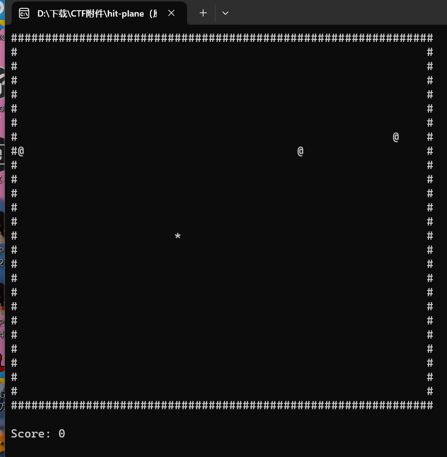

## 完成事项
- 深化指针的学习，以阅读反编译中的相关代码
- IDA细节操作的优化（快捷键）
- 做题流程的优化（做题前先运行程序了解大致逻辑）
- IDA patch花指令的操作优化（运用keypatch插件）
- IDA修改汇编指令（删除错误代码、修改判定程序、跳过判定程序）
- 动态调试跳过判定条件
- Crypto.Util.number 模块下载问题
- MD5的加密
- 学习基础的反调试技巧
- 学习Z3约束求解器
## 未完成事项

- 复现面试的题目
- 学习手工脱壳
## 如何解决未完成事项

- 找师傅要一下WP再重新复现
## 下周待做事项

- 研究一下ret-sync插件的使用
## 本周学习的知识分享
###   C语言中的指针（结合IDA反编译）
#### 常见的指针类型      

   - int *p：一个整形指针变量
   - int *p[3]：由返回整型数据的指针所组成的数组（p和[]先结合）
   - int (*p)[3]：指向整型数组的指针（p先与 * 结合，再与 [] 结合）
   - int **p：指针的指针（指向整型指针），即二级指针
   - int (*p)(int)：函数指针，指向一个函数（返回类型为整型）
#### 一些判断类型的技巧

   - 指针类型：将指针名字去掉 剩下的部分
   - 指针指向的类型：将指针名字和名字左边的指针声明符*去掉 剩下的部分
### 解题流程与操作的优化
#### 解题流程

   1. 先试着运行程序看看程序的大致逻辑（特别是maze类型的题目）
   
   2. 扔到DIE中识别文件类型（查壳、查位数）
   3. IDA进行反编译开始解题
#### IDA操作

   - Y键：更改变量类型
   
   - A键：数据与字符转换
   - X键：查看函数的交叉引用
   
   - G键：地址跳转
   
   - N键：更改变量名称
   
   - /：伪代码注释
   
   - ；：汇编界面注释
   
   - \：隐藏类型描述
   - C键：数据转化为代码
   - Patch：使用keypatch插件修改汇编
   
   
### 动态调试跳过判定条件
   灵感来自于面试时的题目hit-plane， 
    最后的判定条件中需要score>1145141918（好臭啊）才能获得flag，而且还有一个语法错误的printf。可以用修改汇编的方式把判定条件改为>-1或者直接删除（nop）。 既然如此，那么应该也可以使用动态调试跳过该部分直接执行get_flag函数，经过坐牢式研究发现这个方法太麻烦（找到if判断的断点之后运行不到这里，因为总是因为IsOver==0结束程序，而跳过这部分程序又要进行寻址定位和跳过，过于繁琐，不过不失为一种思路吧？），不过也有所收获。
#### x64dbg与IDA的地址对齐

   - 改为x64dbg解析，发现与IDA反编译的地址编码不一样（也可以使用ret-sync插件同步IDA与dbg程序），需要计算地址的偏移量以对齐地址。
   - 以hit-plane.exe程序为例：
   - IDA基址=0000000140001000

       x64dbg基址=00007FF79BA20000                   IDA目标地址=000000014000B176        x64dbg目标地址=000000014000B176+00007FF79BA20000-0000000140001000        =7FF7 9BA2 A176               之后再x64dbg中Ctrl+G进行跳转即可
#### 动态调试强制进入循环
 用dbg打开文件，在判定位置修改Z(F)寄存器的值，使得其跳转/不跳转。
#### Crypto.Util.number 模块下载问题
   在NSS做题的时候（[HUBUCTF 2022 新生赛]ezPython），需要进行bytes与long类型的转换，

   
   
   需要调用long_to_bytes函数(from Crypto.Util.number import long_to_bytes)，要下载Crypto库。后来在CSDN发现（[https://blog.csdn.net/weixin_47419513/article/details/116942795](https://blog.csdn.net/weixin_47419513/article/details/116942795)）
> crypto已经停用，不再更新，而pycryptodome则可以完美替代它，相应的子模块也都有，所以只要安装pycryptodome模块即可。

所以只要用cmd命令进行安装即可  `pip3 install pyCryptodome -i [https://pypi.douban.com/simple](https://pypi.douban.com/simple)`
#### MD5加密
也是在上文遇到的题目里，需要MD5格式输出。可以用python脚本，也可以直接用网页工具。（要注意python在输出字节格式时会有b'    '的修饰，别当成flag内容了！~~别问我怎么知道的~~） 
    
### 反调试基础

- 基本分类
   - 静态：利用系统信息检测调试器
   - 动态：反向利用调试器的工作原理隐藏内部代码和数据
1. IsDebuggerPresent（）函数：会检测当前程序是否被调试，是返回1，否返回0
   - 可以用插件解决
2. CheckRemoteDebuggerPresent（）函数：类似于上面的函数
3. NtQueryInformation（）函数
### 面试题目复现（unsolved）
#### crab（未解决）
无壳，直接IDA 字符串长度为15 第一个加密函数：crab_enc

 根据参数判断是base64加密，15位密码加密后变为20位

第二个加密函数：crab_0o  这是一个通过异或进行对称交换的函数？ （注意21行++应在^=赋值之前执行，IDA的编译不是很细致，按C语言优先级会出问题。查看一下汇编可以看到。）

第三个加密函数：crab_o0o 使a1的每一位+20
#### easyRe（未解决）
无壳64位，放入IDA无法正常编译，看汇编判断为jmp db1的花指令  将该类型的指令都patch掉？ 
#### hit-plane
打开文件查看，是一个躲避掉落物的小游戏，用WASD可以上下左右移动*  无壳64位 在Show（）函数中发现得到flag的方式： 使score>1145141918，显然是做不到的 为了执行内部的get_flag程序，需要跳过if判定，这里可以直接删除if语句以及编译出错的46行 进入汇编，用keypatch nop掉表示if判断的cmp行，以及错误使用printf的call行 再次编译  把修改后的代码保存到源程序里  注意此时不要运行exe，防止占用无法修改 再次启动就会直接获得flag{w0w_y0u_4r3_7he_m4st3r_0f_h1tt1ng_p1an3s!}

### Z3约束求解器

1. 微软出品的开源约束求解器，能够解决很多种情况下的给定部分约束条件寻求一组满足条件的解的问题
2. 下载：win命令行  `pip install z3-solver`
3. 一般使用Python来调用
4. 使用流程
   1. 创建变量声明
   2. 创建约束求解器
   3. 添加约束条件
   4. 判断解是否存在
   5. 求解
5. 使用示例

 这是一个简单的计算程序（注意 Z3 在默认情况下，只寻找满足所有条件的一组解，而不是找出所有解）

完整写法应该是这样 

- **例题：[GDOUCTF 2023]Check_Your_Luck**

下载获得cpp文件，查看代码是一个解方程的问题  根据方程组建立z3求解器  得到解 根据cpp代码知道flag输出格式从而求得 NSSCTF{4544_123_677_1754_777}
### 壳

1. 基础知识
- call：相当于高级语言中的函数调用。进行两步操作： 将下一条的指令的地址压入栈中，再跳转到该地址处。
- ret && retf：将当前的ESP寄存器中指向的地址出栈，然后跳转到这个地址。
- pushad：压栈，程序入口。
- popad：出栈，程序出口。
2. UPX壳
- 工具脱壳：命令行 `upx.exe -d 目标文件名加后缀` 
- 手动脱壳（dump）
   - 全能，可解决魔改（区段名修改、版本信息抹去）
   - 壳原理：用壳解密→执行原程序（前后结构相似）；因此要劫持刚解密完的文件
   - ESP定律：在程序自解密或者自解压过程中, 多数壳会先将当前寄存器状态压栈（pushad）而在解压结束后, 会将之前的寄存器值出栈, 如使用popad. 因此在寄存器出栈时, 往往程序代码被恢复, 此时硬件断点触发（这就是我们要下硬件断点的原因），然后在程序当前位置, 只需要一些单步操作, 就会到达正确的OEP位置
3. ASPack
4. PECompact
5. Themida
6. VMProtect
7. Enigma Protector
- **UPX例题（[SWPUCTF 2022 新生赛]upx）**

DIE分析文件

1. 可直接upx工具脱壳

 扔进IDA  一个简单的逐位异或   NSSCTF{UPX_1s_xord_way_to_encrypt_flag}

2. 手动脱壳（未完成）
## 本周自己学习过程中遇到的问题和疑问点

- 为什么IDA反编译的代码中常出现通过指针引用函数，为什么不直接引用函数？只是为了增加题目难度这么做吗？（查到一些资料但不能深入理解）
   - 需要运行时多态（？）
   - 回调函数：函数指针可以作为参数传递给其他函数，从而实现回调机制。通过函数指针，我们可以动态地指定需要在特定事件发生时执行的函数，增加了程序的灵活性和可扩展性。
   - 动态函数调用：函数指针的值可以在运行时进行更改，从而实现动态函数调用。
   - 函数组合和装饰
- 跨反编译软件和动态调试软件（IDA&x64dbg）的调试寻址非常麻烦，会出现基址不同的偏移，需要额外计算。
- 手动脱壳到底怎么找OEP？还是很疑惑，视频里讲的个例不太适用。
## 情感、思考、观点

- 进行面试之后，倍感师傅们经验丰富，我刚入门不久，还有很多地方需要学习，经验也十分欠缺。逆向七分猜，许多题目定位关键函数需要很多经验进行猜测，积累经验真的很重要。
- 前期做题还是不要做没有WP的题，做不出来坐牢非常浪费时间，还没办法检验自己的想法对不对。先练一些有答案的题，把知识点学会了再说吧。
## 在团队的感触和建议

- 很荣幸我这么菜还能加入这样的团队，学习氛围和某些地方就不一样，还有周报这样的学习积累方式，希望我能在这里与队员们共同进步！
