# Git
Git的使用教程
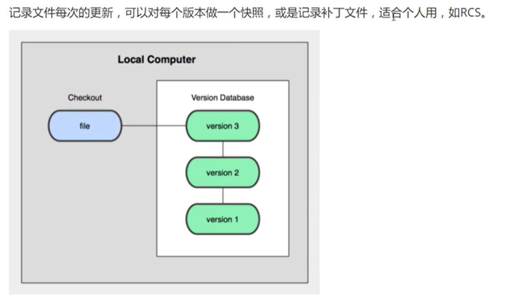
<!-- more -->
## 版本控制
版本迭代，版本管理器
## 本地版本控制

## 集中版本控制
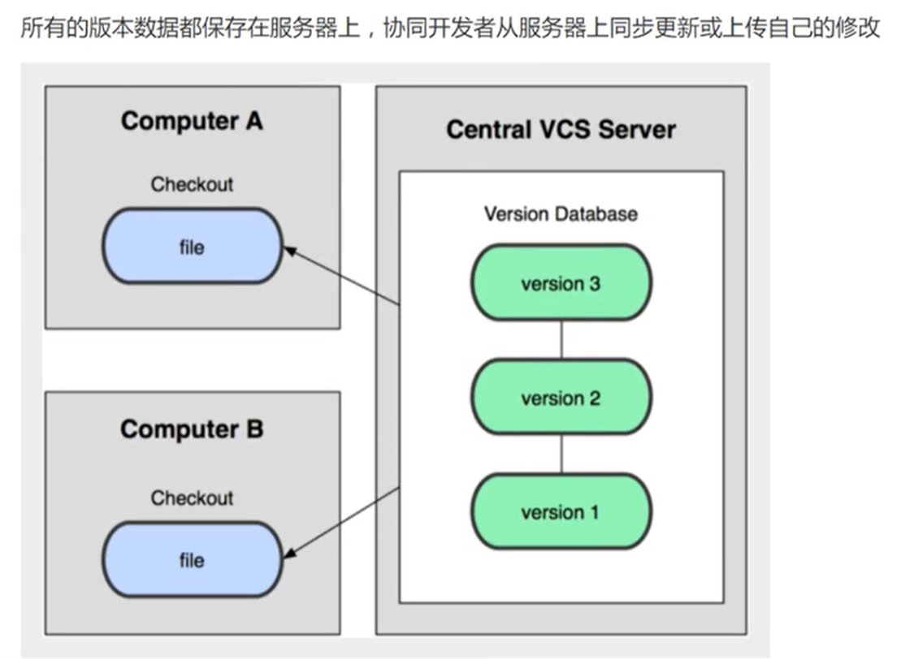 

## 分布式版本控制
 每个人拥有全部代码 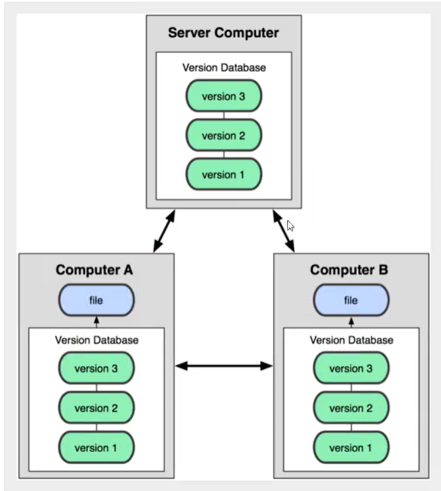
# Git配置
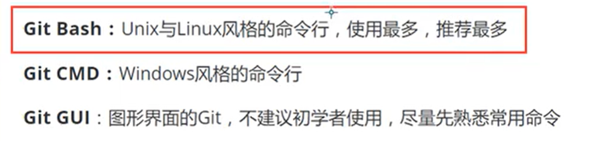 查看配置：`git config -l` 本地配置：`git config --system --list` 全局配置：`git config --global --list` **Git相关配置文件**

1. **Git\etc\gitconfig：系统级**
2. **C:\Users\Administrator\.gitconfig 只适用于当前用户的配置（全局）**

设置用户名：`git config --gloabal user.name "名称"` 设置邮箱：`git config --gloabal user.email "邮箱"`
## Linux命令
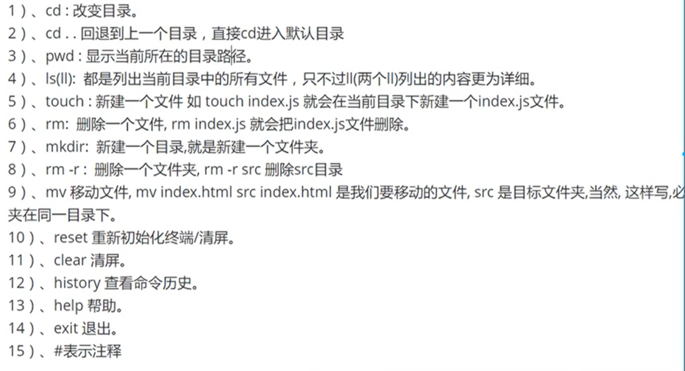
# Git理论
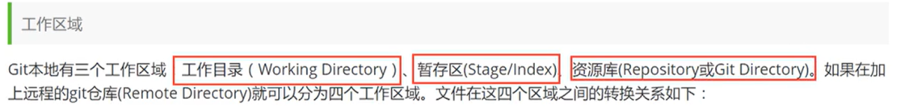  流程：本地—>添加到暂存区—>commit提交到本地git仓库—>push到远程仓库  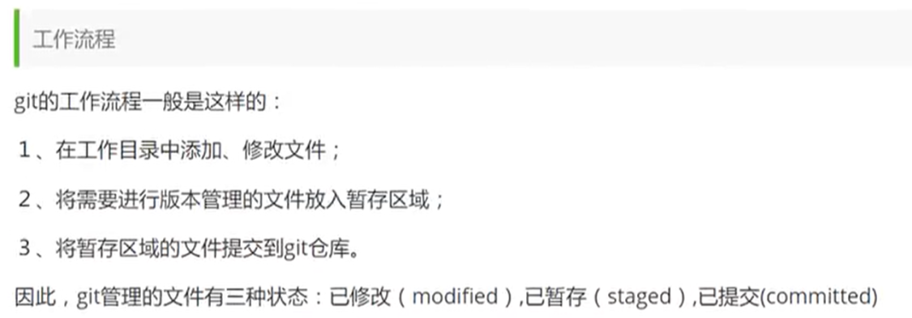 2：`git add .` 3：`git commit`
# Git项目搭建
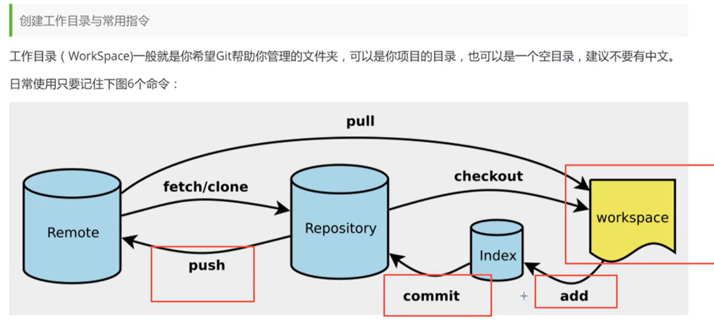
## 本地仓库搭建
创建全新仓库：项目根目录运行 `git init`
## 克隆远程仓库
`git clone [url]`
# Git文件操作
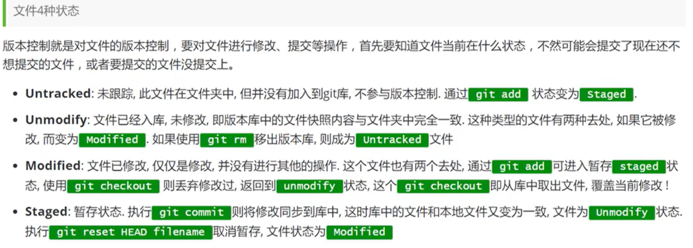 查看文件状态

- `git status [filename]`
- `git status`
- `git add . `      添加所有文件到暂存区
- `git commit -m “消息内容”`    提交暂存区内容到本地仓库（-m 提交信息）

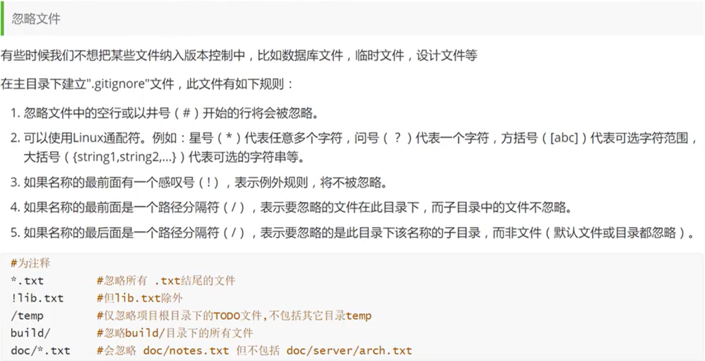
# Github
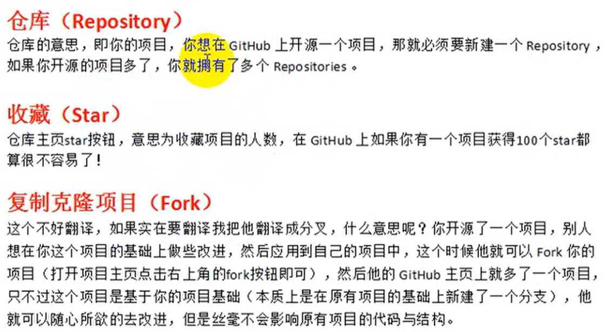 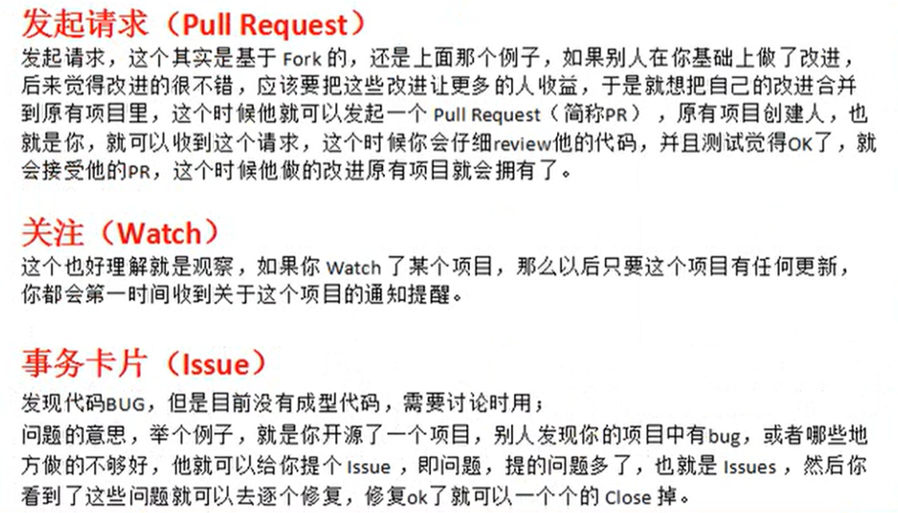
