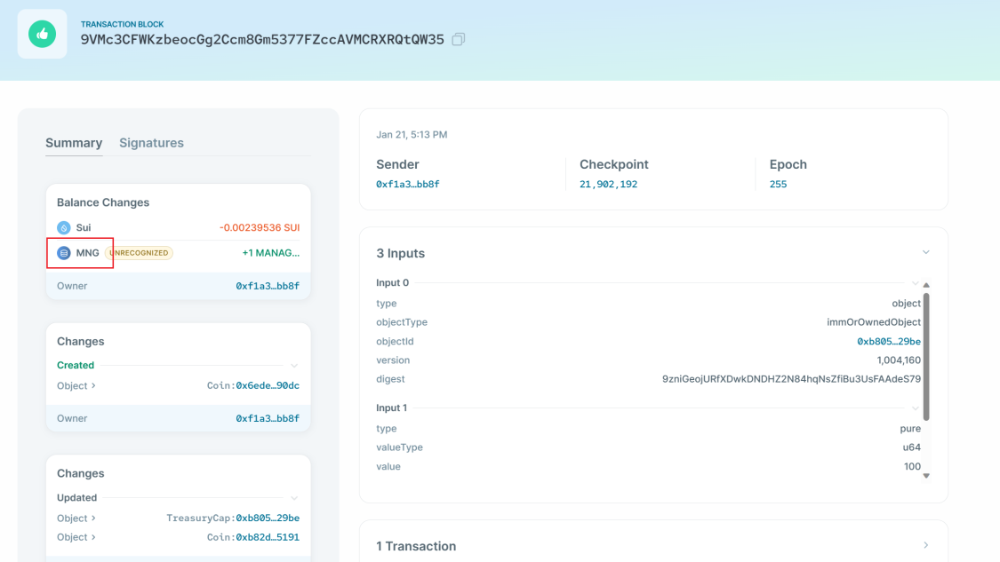
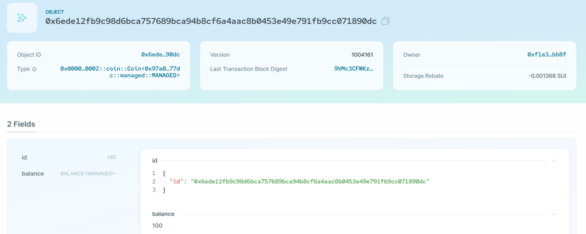

# 1.21 笔记

## 泛型
避免重复的模板函数 在没有范型的情况下，我们可以定义一个包含 u64 类型的 Box  但是，这种类型只能保存 u64 类型的值，为了能够存储其他类型显然我们不能把所有类型的box都枚举完，所以这个时候就需要使用泛型。 （加上尖括号）

## 能力限制
我们可以添加条件去强制传递给泛型的类型必须具有某些能力。（能多不能少）   phantom可以绕过规则

### 示例：generics.move
先部署智能合约：`sui client publish --gas-budget 100000000 --skip-fetch-latest-git-deps --skip-dependency-verification`   类型参数 type-args `sui client call --package 0x92321dc9b575a77207129d0321bb65041fe455f0e1c0c37b95ad0f363b274028 --module g1 --function "create_box" --args 0x2ffb33f9f1516e890e46d07739fecf38cdb4373920dd186d1977203c6771f84c --type-args "0x2::coin::Coin<0x2::sui::SUI>" --gas-budget 10000`

# Witness（见证者模式）
 

- Phantom：我们还想把 witness 资源 PEACE 传入 Guardian，但 PEACE 只有 drop 的能力。回顾我们之前关于能力约束和内部类型的讨论，该规则暗示PEACE也应该有key和storage，因为外部类型Guardian有。但是在这种情况下，我们不想给我们的witness类型添加不必要的能力，因为这样做可能会导致不符合预期的行为和漏洞。我们可以使用关键字`phantom`来解决这种情况。当一个类型参数没有在结构定义中使用，或者它只是作为另一个`phantom`类型参数的参数使用时，我们可以使用phantom关键字来要求Move类型系统放松对内部类型的能力约束规则。

- One Time Witness：一次性见证One Time Witness（OTW）是Witness模式的一个子模式，我们利用模块init函数来确保只创建一个witness资源的实例（所以A类型被保证是唯一的）。

# 发行代币

## Coin资源
 Balance没有Key能力，不能进行全局查找和transfer。而Coin可以，因此把Balance包在Coin里面。

## create_currency 方法
 使用Sui框架中的sui::types::is_one_time_witness 方法检查传入的witness资源是否是一次性见证。 该方法创建并返回两个对象，一个是TreasuryCap资源，另一个是CoinMetadata资源。

### TreasuryCap

### CoinMetadata
这是一个存储已创建的可替换代币的元数据的资源。它包括以下字段。

- `decimals`: 这个自定义可替换代币的精度
- `name`：这个自定义可替换标记的名称
- `symbol`：这个自定义可替换标记的标记符号
- `description`: 这个自定义可替换标记的描述
- ``icon_url'`: 这个自定义可替换代币的图标文件的网址。

## Manage Coin案例
合约部署后，创建的两个不可变对象分别是 `package` 本身和 `Managed Coin` 的 `CoinMetadata object`，交易发送人收到并拥有的对象就是 `Managed Coin` 的 `TreasuryCap` 对象。

### package
 

### CoinMetadata
 

### TreasuryCap
 

## 铸造代币（mint函数）

- `sui client call --function mint --module managed --package $PACKAGE_ID --args $TREASURYCAP_ID \"<amount to mint>\" <recipient address> --gas-budget 3000`

可以看到三个参数分别是 TreasuryCapID、铸造代币数量、接受者地址 实际代码 `sui client call --function mint --module managed --package 0x97a0b24e24d5103bbad0b47688356814c7e8e6b1f94b7907344a505459e677dc --args 0xb805040af4c66a770b9daa1c4646b5f8aac9f257fcd4535c7a45cd717ded29be 100 0xf1a3394e4cfbc855ffcad1774b7505eff2d87659ad135a9fecf2755b1097bb8f --gas-budget 10000000`   运行成功

## 销毁代币（burn函数）

- `sui client call --function burn --module managed --package $PACKAGE_ID --args $TREASURYCAP_ID $COIN_ID --gas-budget 3000`

需要的参数有两个：`TreasuryCapID`和`CoinID`

- Coin ID

 实际代码 `sui client call --function burn --module managed --package 0x97a0b24e24d5103bbad0b47688356814c7e8e6b1f94b7907344a505459e677dc --args 0xb805040af4c66a770b9daa1c4646b5f8aac9f257fcd4535c7a45cd717ded29be 0x6ede12fb9c98d6bca757689bca94b8cf6a4aac8b0453e49e791fb9cc071890dc --gas-budget 10000000`  
