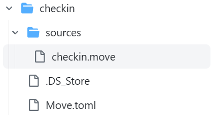
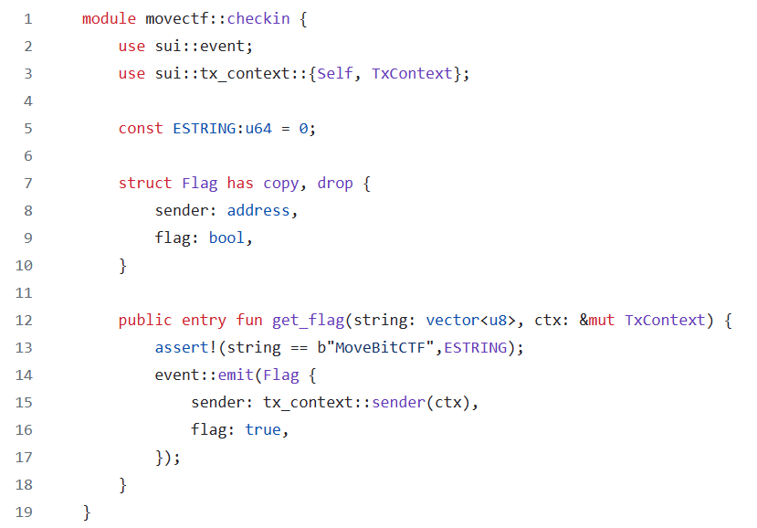

查看智能合约文件   可以看到需要调用的函数`get_flag`只有在输入字符串为“MoveBitCTF”时才能成功运行 `sui client call --function get_flag --module checkin --package 你的packageid --args "MoveBitCTF" --gas-budget 10000000` 将得到的`Transaction Digest`输入即可获得flag
