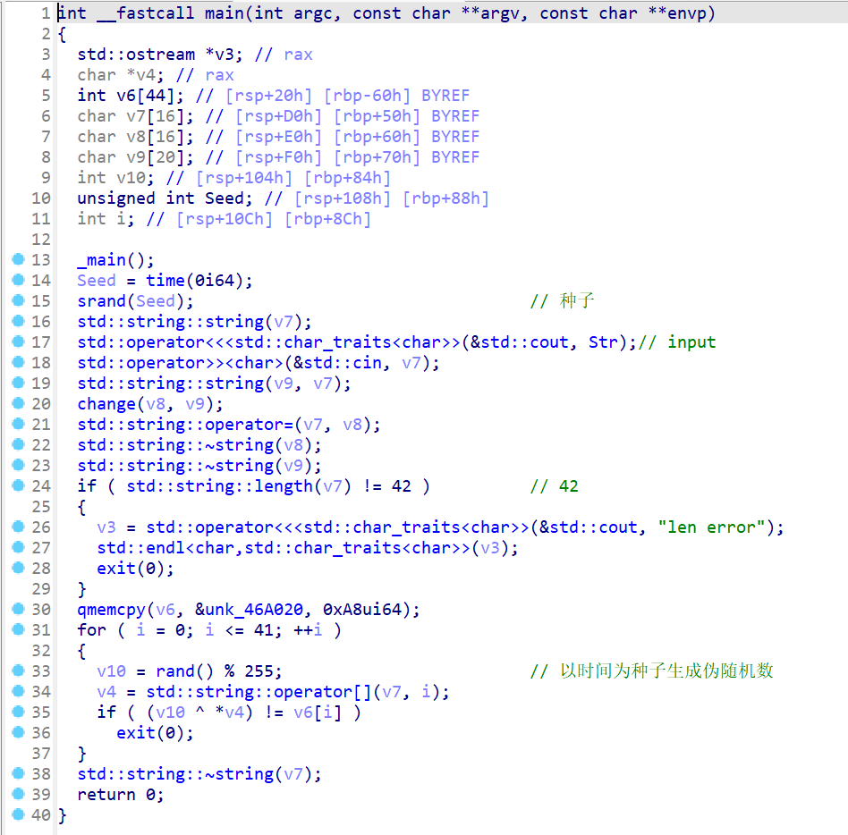
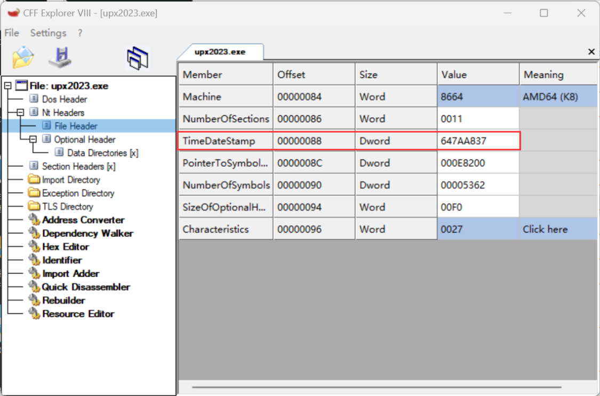
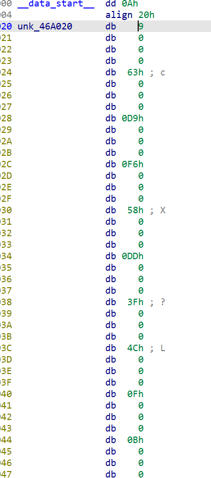
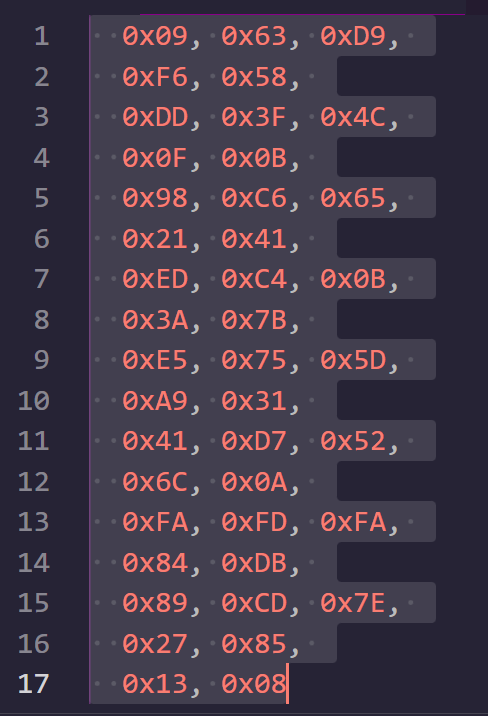
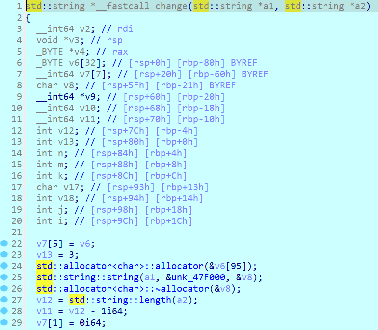
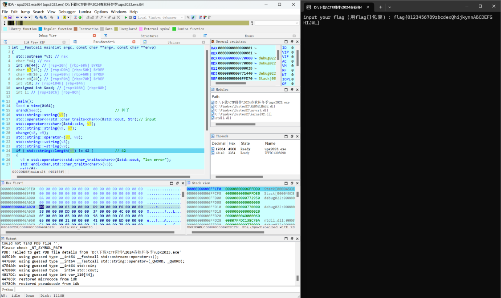
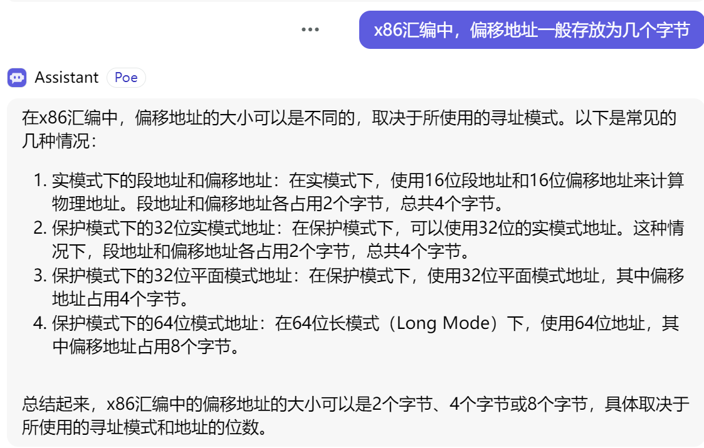
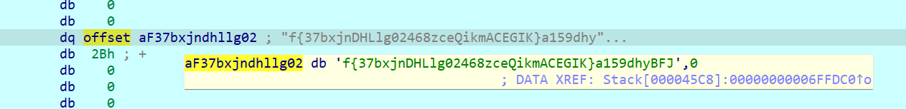

# RE upx2023

改UPX头脱壳不多说了

大致分析后发现利用伪随机数加密
14行 可以看到伪随机数种子是根据时间戳生成的，查询一下文件创建时的时间戳然后在其附近爆破
> Unix 时间戳是从1970年1月1日（UTC/GMT的午夜）开始所经过的秒数，不考虑闰秒。

CFF Explorer打开文件

或者也可以在windows属性里查看创建时间，利用在线工具转化为时间戳

[时间戳(Unix timestamp)转换工具](https://tool.lu/timestamp/)

30行 有密文`unk_46A020`

 

拿非0的42个数据

如何检验爆破结果？20行的 change函数应该对输入进行了加密，但是静态分析太复杂了


我们可以动调到change之后看一下结果



进v7看一下，注意按D切换字节模式（这里dq或者dd都可以），不同的题偏移地址字节长度可能不同




加密前：`flag{0123456789zbcdexQhijkymnABCDEFGHIJKL}`

加密后：`f{37bxjnDHLlg02468zceQikmACEGIK}a159dhyBFJ`

可以看到字符没有改变，仅仅是变换了顺序

变换后第1、2、12、13、33位是由原来的“flag{”移动过去的，相应位置的密文异或正确seed生成的密钥流就应该得到相应的字符。那么只要根据相应位置进行爆破。

```c
#include<stdio.h>
#include<stdlib.h>
int main()
{
    int seed, i, key;
    for (seed = 0x647AA837; seed > 0; seed--)
    {
        srand(seed);
        int right = 1;
        for (i = 0; i <= 32; i++) 
        {
            key = rand() % 255;
            switch (i) 
            {
                case 0:
                    if (key != ('f'^0x09)) //102^9=111(0x6F)
                    {
                        right = 0;
                    }
                    break;
                case 1:
                    if (key != ('{'^0x63)) //123^99=24(0x18)
                    {
                        right = 0;
                    }
                    break;

                case 11:
                    if (key != ('l'^0xC6)) //108^198=170(0xAA)
                    {
                        right = 0;
                    }
                    break;
                case 12:
                    if (key != ('g'^0x65)) //103^101=2(0x02)
                    {
                        right = 0;
                    }
                    break;
                case 32:
                    if (key != ('a'^0xFA)) //97^250=155(0x9B)
                    {
                        right = 0;
                    }
                    break;
                default:
                    break;
            }
            if (right == 0)
            {
                break;
            }
        }
        if (right == 1) 
        {
            printf("%u\n", seed);
            break;
        }
    }
    int data[] = { 0x09, 0x63, 0xD9,
                  0xF6, 0x58,
                  0xDD, 0x3F, 0x4C,
                  0x0F, 0x0B,
                  0x98, 0xC6, 0x65,
                  0x21, 0x41,
                  0xED, 0xC4, 0x0B,
                  0x3A, 0x7B,
                  0xE5, 0x75, 0x5D,
                  0xA9, 0x31,
                  0x41, 0xD7, 0x52,
                  0x6C, 0x0A,
                  0xFA, 0xFD, 0xFA,
                  0x84, 0xDB,
                  0x89, 0xCD, 0x7E,
                  0x27, 0x85,
                  0x13, 0x08 };
    srand(seed);
    for (int i = 0; i < 42; i++)
        printf("%c", ((rand() % 255) ^ data[i]) & 0xff);
}
//1682145110
//f{52bgb-281lg00ff-46f7-ca009c8e}a381-b7191
```
再通过python索引把位置换回来
```python
#upx2023 wp
example="flag{0123456789zbcdexQhijkymnABCDEFGHIJKL}"
back="f{37bxjnDHLlg02468zceQikmACEGIK}a159dhyBFJ"
crypto="f{52bgb-281lg00ff-46f7-ca009c8e}a381-b7191"

for i in example:
    print(crypto[back.index(i)],end="")
#flag{0305f8f2-14b6-fg7b-bc7a-010299c881e1}
```
