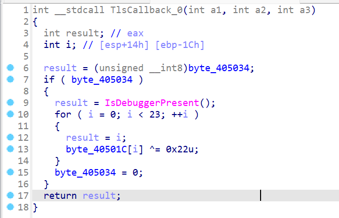
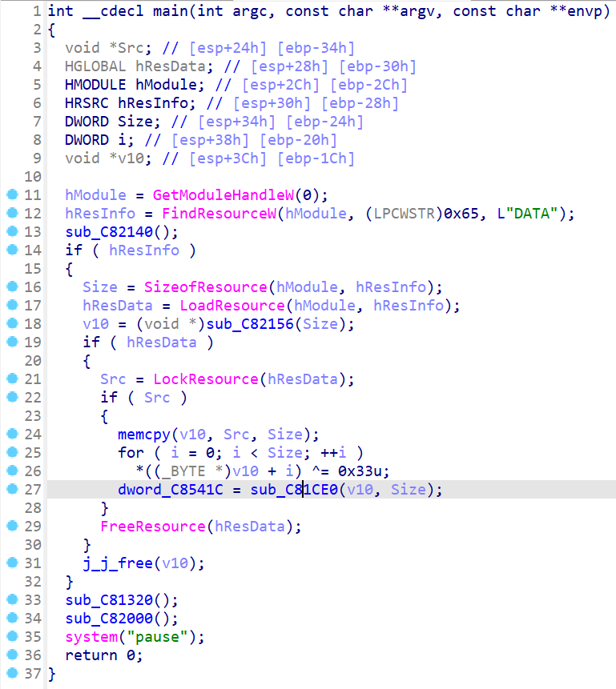
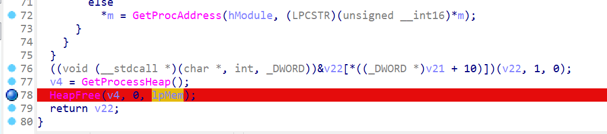

# RE file_encryptor
32位无壳
> 代码逆向分析领域中，TLS（Thread Local Storage，线程局部存储）回调函数（Callback Function）常用反调试。TLS回调函数的调用运行要先于EP代码的执行，该特征使它可以作为一种反调试技术的使用。

动调不起来，main函数直接爆红  肯定有反调试、异常处理 main里面没找到，尝试TLS里面找  这里看到了`IsDebuggerPresent`在`except`异常处理里 改一下控制流，不要去`exit`   回到main函数还有一堆异常处理  全部滚吧，NOP所有except  爆红的花指令修一下 红的那一行按U  这里C一下 E8多余的数据NOP掉    这有个花指令，也修一下，和上面的原理一样  P一下  tab  都修复完了记得`apply patch to`保存到`exe`文件里，不然动调的时候还是会有反调试 完整的main函数  加载的资源数据最终储存在27行`dword_C8541C`里，dll资源在`sub_C81CE0`里加载，我们要把它取出来查看输出函数相关参数 进`sub_C81CE0`在结尾下个断点，我们需要`IpMem`里的资源  动调点进去  按D直到出现这个地址  跟过去  这里Shift+*直接OK  Shift+E提取数据  选择`raw bytes`格式，导出后缀无所谓 放进CFF查看  这里看到了调用了`CryptEncrypt`函数
> CryptEncrypt 是 Windows 加密服务提供程序 (Cryptographic Service Provider, CSP) 中的一个函数，用于加密数据。它是基于 Windows 的加密API (Cryptography API: Next Generation, also known as CNG) 的一个组成部分。
> 在使用 CryptEncrypt 函数之前，通常需要先初始化一个 CryptoAPI_BLOB 结构体，然后使用 CryptCreateHashHandle 或其他相关函数来创建一个哈希句柄。之后，可以使用这个句柄和密钥来调用 CryptEncrypt 函数。

总之是Windows自带的加密函数 在main函数34行 加密部分往里面找，最后看到一个参数是0xB的，对应加密函数  改成解密函数 对应0x5  断在v6启动的位置  发现动调到这里又自动退出了  看一下汇编 
> JNZ指令的含义是“Jump if Not Zero”，即当结果不为0时转移。如果执行操作的寄存器或操作数的结果不为0，则控制权转移到指定的标签位置。
> JZ指令的含义是“Jump if Zero”，即当结果为0时转移。如果执行操作的寄存器或操作数的结果为0，则控制权转移到指定的标签位置。

所以这里把`jz`改成`jnz`就不会跳转到`exit`去了 （也可以动调的时候该标志位） 
## 注意动调之前一定要`apply patch to`！！！
继续动调，跑到这里又跳出去了  注意一下第10行有关于文件路径的函数`SHGetKnownFolderPath`和参数`ppszPath` 第四行定义的`ppszPath`是一个指向宽字符串的指针，用于存储已知文件夹的路径。直接点开看不见，我们动调。  点进去看一下  一直D到字符串出来  可以看到要求的路径是在你的桌面 回到原来的函数  看第12行 `if ( PathCombineW(pszDest, ppszPath, L"document") ):`使用`PathCombineW`函数将已知文件夹的路径和`"document"`字符串合并，存储在`pszDest`中。 那路径就是 `C:\\Users\37785\\Desktop\\document`（Desktop前的部分因人而异） 第13行`if ( PathCombineW(FileName, pszDest, L"*.*") ):`使用`PathCombineW`函数将`pszDest`和`"."`字符串合并，存储在FileName中。这将生成一个用于搜索所有文件的通配符模式。（文心一言友情供稿） 也不知道是怎么搜的，反正把`1.txt`扔进去应该没问题 动调F8到这里  看一下`1.txt`  OHHHHHHHHHHHHHHHH！！！！！！！！！！！！！！！！
